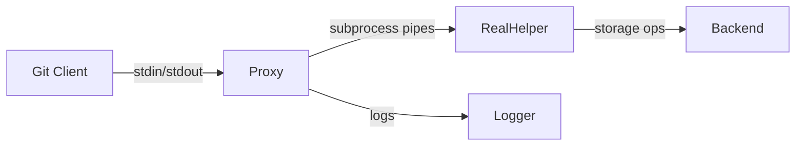

# Git Remote Proxy Specification

## 1. Introduction
The `git-remote-proxy` acts as an intermediary between Git and real remote helpers, enabling:
- Protocol analysis by logging all communications
- Transparent delegation to underlying helpers
- Potential protocol manipulation (future extension)

## 2. Architecture


### Components
- **Proxy Core**: Handles Git communication and command dispatch
- **Helper Invoker**: Spawns/manages real helper subprocess
- **Logger**: Records bidirectional communication

## 3. Configuration
Use URL format: `proxy://<original-url>`

### Environment Variable
```bash
# Specifies helper name without 'git-remote-' prefix
export GIT_REMOTE_PROXY_HELPER="real-helper-name"
```

### Examples
```bash
# Clone via proxy
git clone proxy://example.com/hello/test-repo

# Configure environment
export GIT_REMOTE_PROXY_HELPER="demo"
```

## 4. Command Flow
1. Git invokes `git-remote-proxy <remote-name> <proxy-url>`
2. Proxy transforms URL: replaces "proxy://" with "<helper-name>://"
3. Proxy spawns real helper: `git-remote-<helper-name> <remote-name> <transformed-url>`
4. Bidirectional forwarding:
   - Git ↔ Proxy (stdin/stdout)
   - Proxy ↔ Real Helper (pipes)
5. Logging occurs for all communications

## 5. Logging
All communication is logged to stderr using simple format:

```plaintext
[GIT→PROXY] <content>
[PROXY→HELPER] <content>
[HELPER→PROXY] <content>
[PROXY→GIT] <content>
```

### V1 Limitations
- No command-specific handling
- Pure byte stream forwarding
- No verbosity controls

## 6. Implementation Notes
- Uses existing `pktline` module for packet handling
- Real helper path resolved via `git remote-helper`
- Exit codes propagate from real helper