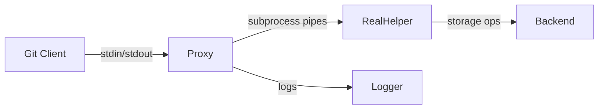

# Git Remote Proxy Specification

## 1. Introduction
The `git-remote-proxy` acts as an intermediary between Git and real remote helpers, enabling:
- Protocol analysis by logging all communications
- Transparent delegation to underlying helpers
- Potential protocol manipulation (future extension)

## 2. Architecture


### Components
- **Proxy Core**: Handles Git communication and command dispatch
- **Helper Invoker**: Spawns/manages real helper subprocess
- **Logger**: Records bidirectional communication

## 3. Configuration
Use URL format: `proxy://<remote-url>`

### Environment Variable
```bash
# Specifies helper name without 'git-remote-' prefix
export GIT_PROXY_HELPER="real-helper-name"
```

### Examples
```bash
# Clone via proxy
git clone proxy://example.com/hello/test-repo

# Configure environment
export GIT_PROXY_HELPER="demo"
```

## 4. Command Flow
1. Git invokes `git-remote-proxy <remote-name> <proxy-url>`
2. Proxy transforms URL: replaces "proxy://" with "<helper-name>://"
3. Proxy spawns real helper: `git-remote-<helper-name> <remote-name> <transformed-url>`
4. Bidirectional forwarding:
   - Git ↔ Proxy (stdin/stdout)
   - Proxy ↔ Real Helper (pipes)
5. Logging occurs for all communications

## 5. Advanced Features

### Capabilities Shadowing
Proxy can override real helper's capabilities using environment variable:
```bash
export GIT_PROXY_CAPABILITIES="fetch,option,push"
```
- When "capabilities" command is received, proxy outputs configured capabilities instead of forwarding to real helper
- Allows observing how helper behaves without certain capabilities
- Default capabilities: "fetch,option,push,connect,stateless-connect"

### Command-Specific Logging
Proxy provides enhanced logging for different command types:
- **Standard commands (list, fetch, push):** Logged as plain text lines
- **Connect/stateless-connect:** Logged in pktline format with hex length prefixes
  - Example: `000fconnect git://host`

### Log Format
- Git -> Real Helper: `[GIT -> HELPER] <message>`
- Real Helper -> Git: `[HELPER -> GIT] <message>`

## 6. Error Handling
Proxy handles errors by:
1. Logging detailed error message
2. Exiting with non-zero status code
3. Forwarding error to Git when possible

## 7. Example Use Cases
1. **Observing fetch/push workflows:**
```bash
export GIT_PROXY_CAPABILITIES="option,fetch,push"
git fetch origin
```

2. **Debugging stateless-connect:**
```bash
export GIT_PROXY_CAPABILITIES="option,stateless-connect"
git fetch origin
```

## 8. Implementation Notes
- Real helper path resolved via `git --exec-path`